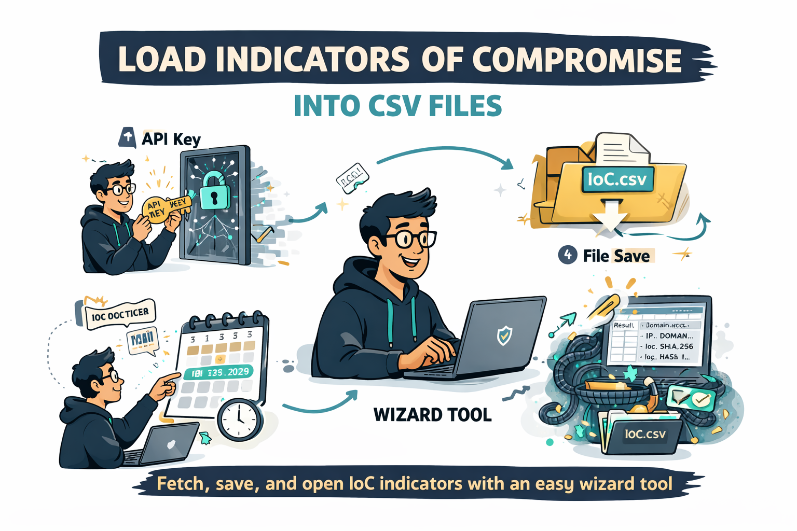

# ThreatIntel Feed Wizard

Cross-platform desktop app (and CLI) that downloads STIX 2.1 threat intelligence indicators from the [Trend Vision One](https://www.trendmicro.com/en_us/business/products/detection-response/xdr.html) `/v3.0/threatIntel/feeds` API and exports them as CSV.

## Download

Pre-built binaries are available on the [GitHub Releases](../../releases) page.

Each release includes builds for:

| Platform | Architecture | File |
|---|---|---|
| macOS | Intel (x86_64) | `threatintel-feed-wizard-vX.X.X-macos-intel.zip` |
| macOS | Apple Silicon (arm64) | `threatintel-feed-wizard-vX.X.X-macos-arm.zip` |
| Windows | Intel (x86_64) | `threatintel-feed-wizard-vX.X.X-windows-intel.zip` |

1. Go to the [latest release](../../releases/latest)
2. Download the `.zip` for your platform
3. Extract and run `threatintel-feed-wizard` (or `threatintel-feed-wizard.exe` on Windows)

> On macOS you may need to right-click → Open the first time to allow the app past Gatekeeper.

## Features

- 6-step wizard: Intro → API Key → Date/Time → Download → Save → Done
- Supports all 9 Trend Vision One regional servers
- Date/time picker to select the query start time (defaults to last sync or 7 days ago)
- Paginated download with live progress
- STIX pattern parsing extracts IoC type and value (domain, IP, SHA-256, URL, etc.)
- CSV export with UTF-8 BOM for Excel compatibility
- API key, region, and last sync timestamp stored securely via OS keyring (macOS Keychain / Windows Credential Manager)
- Done screen with clickable link to the exported file
- CLI mode for scripting and automation

## Requirements

- Go 1.21+
- A Trend Vision One API key with the **Threat Intelligence** role

### macOS build dependencies

Fyne requires C compilers and system headers. On macOS these come with Xcode Command Line Tools:

```
xcode-select --install
```

## Build

```bash
go build -o threatintel-feed-wizard .
```

## Usage

### GUI (default)

```bash
./threatintel-feed-wizard
```

The wizard walks you through entering your API key, selecting a region, picking a start date/time, downloading indicators, and saving the CSV.

### CLI

```bash
./threatintel-feed-wizard -cli -key YOUR_API_KEY -region eu -out indicators.csv
```

| Flag | Default | Description |
|---|---|---|
| `-cli` | `false` | Run in headless CLI mode |
| `-key` | | API key (falls back to keyring if omitted) |
| `-region` | saved region or `us` | Region code (see table below) |
| `-start` | last sync or 7 days ago | Start date-time in ISO 8601 UTC (e.g. `2024-01-01T00:00:00Z`) |
| `-out` | `TAITI_YYMMDD.csv` | Output file path |

Available regions:

| Code | Region |
|---|---|
| `us` | United States |
| `eu` | Germany |
| `sg` | Singapore |
| `jp` | Japan |
| `au` | Australia |
| `in` | India |
| `mea` | United Arab Emirates |
| `uk` | United Kingdom |
| `ca` | Canada |

## CSV output

| Column | Source | Format |
|---|---|---|
| id | `id` | as-is |
| type | parsed from `pattern` | IoC type (domain, ip, sha256, url, etc.) |
| value | parsed from `pattern` | extracted IoC value |
| name | `name` | as-is (empty if missing) |
| description | `description` | as-is (empty if missing) |
| indicator_types | `indicator_types` | semicolon-joined |
| pattern | `pattern` | raw STIX pattern |
| pattern_type | `pattern_type` | as-is |
| pattern_version | `pattern_version` | as-is (empty if missing) |
| created | `created` | ISO 8601 |
| modified | `modified` | ISO 8601 |
| valid_from | `valid_from` | ISO 8601 |
| valid_until | `valid_until` | as-is (empty if missing) |
| confidence | `confidence` | integer (empty if missing) |
| labels | `labels` | semicolon-joined |
| kill_chain_phases | `kill_chain_phases` | `chain:phase` semicolon-joined |
| created_by_ref | `created_by_ref` | as-is (empty if missing) |

## Project structure

```
├── main.go                  # Entry point (GUI + CLI)
├── api/
│   ├── models.go            # Shared data types (Region, Indicator, STIXBundle, …)
│   └── engine.go            # HTTP client, pagination, error handling
├── credential/
│   └── store.go             # OS keyring abstraction (API key, region, last sync)
├── csv/
│   └── exporter.go          # CSV writer with UTF-8 BOM + STIX pattern parser
├── images/
│   └── embed.go             # Embedded wizard step images
└── ui/
    ├── screen.go            # WizardScreen interface
    ├── state.go             # Shared wizard state
    ├── wizard.go            # Screen navigation controller
    ├── padding.go           # Layout helpers
    ├── intro_screen.go      # Step 1 – Welcome
    ├── apikey_screen.go     # Step 2 – API key + region
    ├── datetime_screen.go   # Step 3 – Start date/time picker
    ├── download_screen.go   # Step 4 – Paginated download
    ├── save_screen.go       # Step 5 – File save dialog
    └── done_screen.go       # Step 6 – Summary + quit
```

## License

MIT
